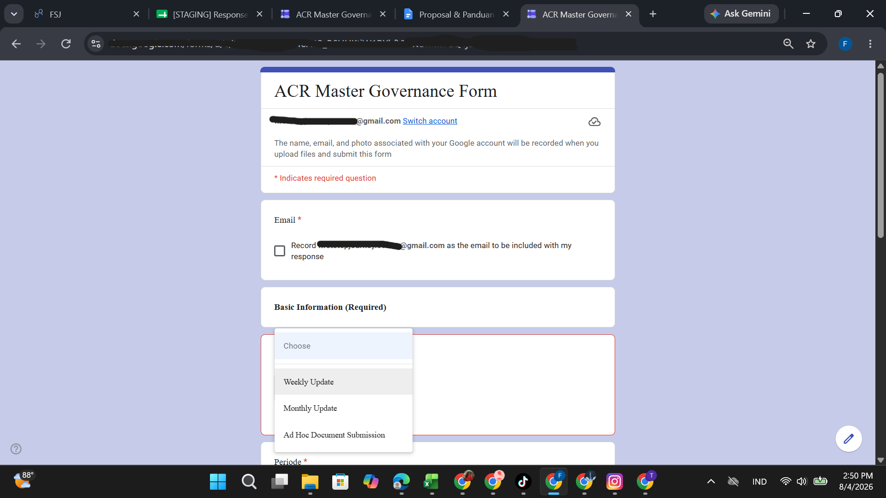
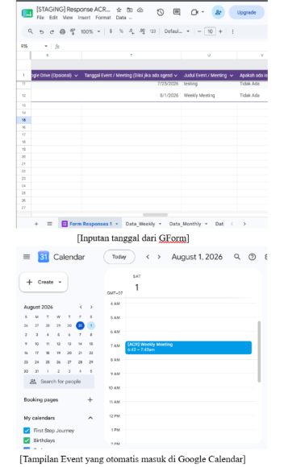
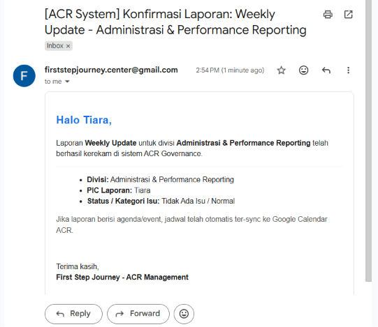
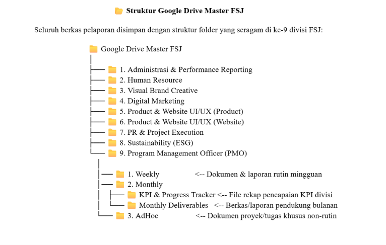
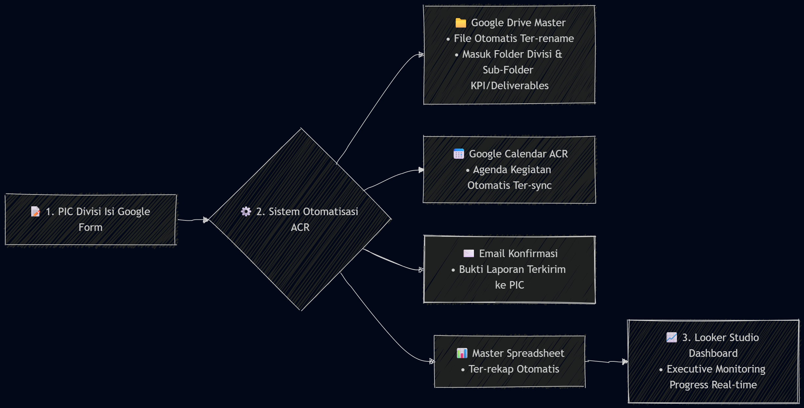
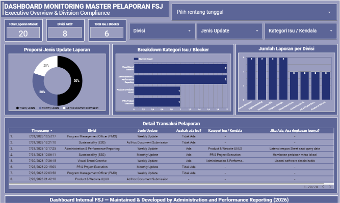

# 🚀 End-to-End Performance Reporting Automation System

An end-to-end reporting automation system designed to streamline organizational performance reporting workflows, from data collection and document management to automated notifications, calendar synchronization, and interactive dashboard reporting.

This project was independently developed during my internship as **Administration & Company Report Intern** at **First Step Journey** to help reduce manual administrative work, standardize reporting processes, and improve reporting visibility across multiple divisions.

> **🚧 Project Status**
>
> This project is currently **under active development**.
>
> The existing version already automates the end-to-end reporting workflow and includes an interactive monitoring dashboard. Additional dashboards, reporting metrics, and analytical features are currently being developed to provide more comprehensive business insights.

---

# 🏢 Business Context

Managing organizational performance reports across multiple divisions can become increasingly challenging as reporting frequency grows.

Previously, reports were submitted manually through various communication channels, making it difficult to:

- monitor submission status,
- organize supporting documents,
- schedule reporting activities,
- notify report owners,
- and track overall reporting performance.

These manual processes required repetitive administrative work and reduced reporting visibility for management.

To address these challenges, an integrated automation workflow was developed using Google Workspace to centralize the reporting process into a single automated system.

---

# 🎯 Project Objectives

This project aims to:

- Standardize organizational performance reporting workflows.
- Automate report submission through Google Forms.
- Automatically synchronize reporting schedules with Google Calendar.
- Send confirmation emails after successful submissions.
- Organize uploaded files into structured Google Drive folders.
- Build an interactive dashboard for monitoring reporting activities.
- Reduce repetitive administrative tasks through workflow automation.

---

# ✨ Key Features

## 📄 Google Form Reporting

A standardized reporting form used by multiple divisions to submit periodic performance reports.

<p align="center">

</p>

---

## 📅 Google Calendar Integration

Automatically creates calendar events for reports containing scheduled activities, ensuring important events are visible without manual calendar updates.

<p align="center">

</p>

---

## 📧 Automated Email Confirmation

Automatically sends confirmation emails to the assigned PIC after each successful report submission.

<p align="center">

</p>

---

## 📂 Automated Google Drive Organization

Uploaded files are automatically renamed and organized into a standardized folder hierarchy based on division, reporting period, and document category.

<p align="center">

</p>

---

## ⚙️ Workflow Automation

Google Apps Script orchestrates the complete reporting workflow, including:

- duplicate submission prevention,
- dynamic header mapping,
- calendar synchronization,
- email notifications,
- automated document organization.

<p align="center">

</p>

---

# 📊 Dashboard Overview

The processed reporting data is visualized through an interactive **Looker Studio** dashboard, allowing stakeholders to monitor reporting activities and organizational performance in a single view.

Current dashboard includes monitoring for:

- Report submissions
- Reporting completion status
- KPI progress
- Division performance
- Reporting trends
- Issue monitoring

> 🚧 Additional dashboards and reporting metrics are currently under development.

---

# 🖼 Dashboard Preview

<p align="center">

</p>

---

# 🔄 System Workflow

```text
Google Form
      │
      ▼
Google Sheets
      │
      ▼
Google Apps Script Automation
      ├── Duplicate Prevention
      ├── Dynamic Header Mapping
      ├── Calendar Synchronization
      ├── Email Notification
      └── Google Drive Organization
      │
      ▼
Reporting Dataset
      │
      ▼
Looker Studio Dashboard
```

---

# 📂 Repository Structure

```text
.
├── assets/
│
├── automation/
│   ├── main.gs
│   ├── README.md
│   ├── ARCHITECTURE.md
│   ├── INSTALLATION.md
│   └── TRIGGER_SETUP.md
│
├── data/
│   ├── dummy/
│   └── README.md
│
├── presentation/
│   └── performance-reporting-automation-system.pdf
│
├── LICENSE
├── .gitignore
└── README.md
```

---

# 🛠 Tools

| Category | Tools |
| --- | --- |
| Automation | Google Apps Script |
| Data Collection | Google Forms |
| Spreadsheet | Google Sheets |
| Dashboard | Looker Studio |
| Calendar | Google Calendar |
| Cloud Storage | Google Drive |
| Email Service | Gmail |
| Documentation | Google Docs |
| Version Control | Git & GitHub |

---

# 💼 Skills Demonstrated

### ⚙️ Automation

- Workflow Automation
- Google Apps Script
- Process Automation
- Trigger-based Automation

### 📊 Data Management

- Reporting Pipeline
- Data Validation
- Dynamic Header Mapping
- File Management

### 📈 Business Intelligence

- Performance Monitoring
- KPI Reporting
- Dashboard Development
- Data Visualization

### 🏢 Business Process

- Process Standardization
- Administrative Automation
- Digital Workflow Design
- Operational Reporting

---

# 🔒 Data Privacy

The original system was developed using internal operational data during an internship project.

To protect organizational confidentiality, this repository contains:

- anonymized dummy datasets,
- recreated dashboard examples,
- sanitized automation configuration,
- public-safe documentation.

No confidential organizational data is included in this repository.

---

# 🚀 Conclusion

This project demonstrates how a manual organizational reporting process can be transformed into an integrated automation system using the Google Workspace ecosystem.

By combining workflow automation, document management, reporting pipelines, and dashboard visualization, the system reduces repetitive administrative work while providing better visibility into organizational reporting performance.

The project is actively being expanded with additional dashboards and monitoring capabilities to support more comprehensive performance analysis.
